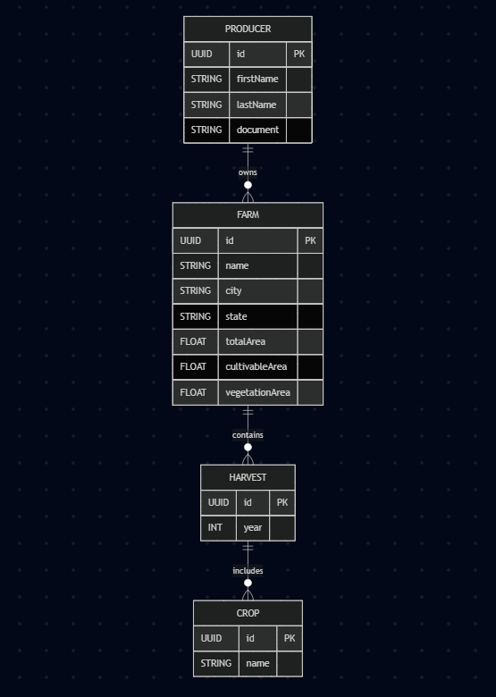

# 🌾 Brain Agriculture API

A **Brain Agriculture** é uma API RESTful desenvolvida com NestJS para gerenciar produtores rurais, fazendas, safras e culturas agrícolas, fornecendo também dados analíticos para dashboards.

## 📚 Sumário

- [Tecnologias Utilizadas](#tecnologias-utilizadas)
- [Funcionalidades](#funcionalidades)
- [Instalação](#instalação)
- [Ambiente de Desenvolvimento](#ambiente-de-desenvolvimento)
- [Execução do Projeto](#execução-do-projeto)
- [Documentação da API](#documentação-da-api)
- [Seed de Dados](#seed-de-dados)
- [Testes](#testes)
- [Diagrama de Entidades](#diagrama-de-entidades)
- [Autores](#autores)

---

## 🛠 Tecnologias Utilizadas

- **Node.js**
- **NestJS**
- **PostgreSQL**
- **TypeORM**
- **Swagger (OpenAPI)**
- **Jest** (para testes)
- **Docker** (opcional, para ambiente containerizado)

---

## 🚀 Funcionalidades

### 👨‍🌾 Produtores (Producers)

- Criar, listar, buscar por ID e excluir produtores.

### 🌱 Fazendas (Farms)

- Criar, listar, buscar por ID e excluir fazendas.
- Relacionamento com produtores.
- Armazena informações como área total, área cultivável e vegetação.

### 🌾 Safras (Harvests)

- Criar, listar, buscar por ID e excluir safras.
- Cada safra pertence a uma fazenda e possui um ano.
- Constraint única por fazenda + ano (apenas se `deletedAt` for `NULL`).

### 🌽 Culturas (Crops)

- Criar, listar, buscar por ID e excluir culturas.
- Cada cultura está ligada a uma safra.
- Constraint única por nome + safra (também considerando `deletedAt`).

### 📊 Dashboard

- Total de fazendas cadastradas.
- Total de hectares registrados.
- Gráficos de pizza:
  - Por estado.
  - Por cultura plantada.
  - Por uso do solo (área agricultável vs vegetação).

---

## 🌐 API Online

Acesse a API em produção:

🔗 [https://brain-agriculture-production-bb20.up.railway.app](https://brain-agriculture-production-bb20.up.railway.app)

---

## ⚙️ Instalação

1. Clone o repositório:

```bash
git clone https://github.com/caiobuteri/brain-agriculture.git
cd brain-agriculture
```

2. Instale as dependências:

```bash
yarn install
```

3. Configure o banco de dados PostgreSQL no arquivo .env:

```ts
DB_HOST = 'localhost';
DB_PORT = '5432';
DB_NAME = 'brain_agriculture';
DB_USERNAME = 'postgres';
DB_PASSWORD = 'asdf1234';
DB_SCHEMA = 'public';
```

## 💻 Ambiente de Desenvolvimento

1. Rode as migrations para criação das tabelas + população do banco com dados de exemplo:

```bash
yarn migration:run
```

2. Inicie o servidor:

```ts
yarn start:dev
```

## 📖 Documentação da API

A documentação está disponível automaticamente em:

> [https://brain-agriculture-production-bb20.up.railway.app/api](https://brain-agriculture-production-bb20.up.railway.app/api)

Ela é gerada com **Swagger (OpenAPI)** e inclui:

- Todas as rotas disponíveis
- Tipos de dados esperados (DTOs)
- Respostas esperadas
- Códigos de status HTTP
- Tags organizadas por módulo

### 📦 Exemplo de configuração no projeto

O Swagger é configurado no `main.ts` da aplicação NestJS utilizando o `DocumentBuilder`:

```ts
const config = new DocumentBuilder()
  .setTitle('Brain Agriculture Documentation')
  .setDescription('The Brain Agriculture API Documentation')
  .setVersion('1.0')
  .addTag('brain-agriculture')
  .build();

const document = SwaggerModule.createDocument(app, config);
SwaggerModule.setup('api', app, document);
```

## 🌱 Seed de Dados

Para fins de testes e desenvolvimento, o projeto inclui uma migration responsável por popular automaticamente o banco com dados realistas e coerentes com o domínio da aplicação:

- **3 produtores** com dados simulando nomes reais
- **Cada produtor** possui entre **1 a 2 fazendas**
- **Cada fazenda** possui entre **1 a 3 safras**
- **Cada safra** contém **1 a 2 culturas (crops)**

> 📌 **Observação:** Ao executar as migrations do TypeORM, essa estrutura de dados já será inserida automaticamente no banco de dados.  
> Você não precisa se preocupar em inserir manualmente os registros iniciais.

## ✅ Testes

Executar todos os testes automatizados com:

```bash
yarn test
```

Você pode rodar um teste específico:

```bash
yarn test src/farms/farms.service.spec.ts
```

## 🗺 Diagrama de Entidades

## 🧩 Diagrama Entidade-Relacionamento (ER)



## 👨‍💻 Autores

Desenvolvido por:

_Caio Buteri_
